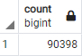
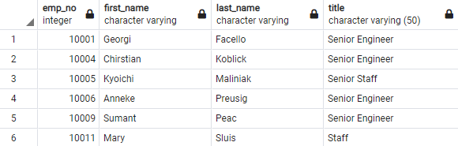
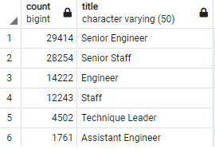
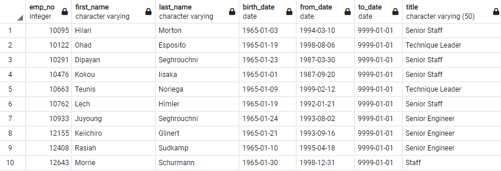
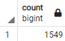
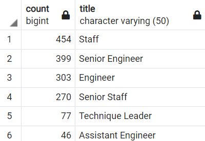

# Pewlett-Hackard-Analysis
## Overview of the analysis: 
The purpose of this analysis is to help the company Pewlett-Hackard determine their soon to retire employees, since most employees have been working there for a long time, we can see a "Silver Tsunami" coming. In other words, the company needs to identify older employees, hire new and younger folk working and get have soon-retiring employees as mentors of the new generations of employees.
## Results: 
During the process of this challenge four different tables were generated:
### Retirement Titles:
The query used to create this table was:

    SELECT e.emp_no, e.first_name, e.last_name, ti.title, ti.from_date, ti.to_date
    INTO retirement_titles
    FROM employees as e
    INNER JOIN titles as ti
	    ON e.emp_no = ti.emp_no
    WHERE (e.birth_date BETWEEN '1952-01-01' AND '1955-12-31')
    ORDER BY emp_no ASC;

This table contained the employee number, first name and last name from the employees table and the title, hiring date and last date of employment from the titles table. The employees were filtered by they birth date, between the years 1952 and 1955. We can see that we have a number of 133,776 employees in this table, however, as shown in the table below, there are some employees that are repeated due to change in departments.

### Unique Titles
The query used to create this table was:

    SELECT DISTINCT ON (rt.emp_no) rt.emp_no,
	    rt.first_name,
	    rt.last_name,
	    rt.title
    INTO unique_titles
    FROM retirement_titles as rt
    ORDER BY rt.emp_no, rt.to_date DESC;
    
In order to solve the problem from the first table we used the **DISTINCT ON** statement from sql to filter throught the repeated number of employees and get the last title that each employee received. The new count of employee dropped from 133,776 to 90,398 employees, meaning that we had 47,378 employee numbers repeated, a 32.42% less than in the previous table.

### Retiring Titles
The query used to create this table was:

    SELECT COUNT(emp_no), title
    INTO retiring_titles
    FROM unique_titles 
    GROUP BY title
    ORDER BY COUNT(emp_no) DESC;

The next table that was created consisted in grouping employees by each title, so we can see how many employees are retiring from each role in the company. We can see that there are more than 60% of retiring employees in the "Senior Engineer" and "Senior Staff" categories combined, and there are only 2 persons retiring from the "Manager" area.

### Mentorship Elegibility
The query used to create this table was:

	SELECT DISTINCT ON(e.emp_no)e.emp_no, 
	e.first_name, 
	e.last_name, 
	e.birth_date, 
	de.from_date, 
	de.to_date, 
	ti.title
	INTO mentorship_eligibilty
	FROM employees as e
	INNER JOIN dept_emp as de
		ON e.emp_no = de.emp_no
	INNER JOIN titles as ti
		ON e.emp_no = ti.emp_no
	WHERE (e.birth_date BETWEEN '1965-01-01' AND '1965-12-31')
	     AND (de.to_date = '9999-01-01')
	ORDER BY e.emp_no;
For the last table we filtered the employees that where born in 1965 that are currently working in the company, in order to be elegible to become a mentor of the different areas. There are  table is shown below:

## Summary:
Provide high-level responses to the following questions, then provide two additional queries or tables that may provide more insight into the upcoming "silver tsunami."
#### How many roles will need to be filled as the "silver tsunami" begins to make an impact?
As we previously saw, Pewlett-Hackard will have 90,398 employees retiring and the company will need to fill those positions in the following years.

#### Are there enough qualified, retirement-ready employees in the departments to mentor the next generation of Pewlett Hackard employees?
There are 1,549 employees that are eligible for the mentorship program, so there will be 58 new employees in charge of each mentor, which can be a very extensive and difficult job, and further analyzing the data we can see that there are no employees thar are qualified for being a mentor in the "Manager" area. So the best option will be to reduce the mentorship elegibility conditions in order that employees with previous titles as managers qualify for being a manager mentor and increase the number of possible mentors in the enterprise.

### Additional queries

	-- Query to obtain the number of employees that are in mentorship_elegibility table
	SELECT COUNT(emp_no) 
	FROM mentorship_eligibilty;

	-- Query to obtain the number of employees in each area
	SELECT COUNT(emp_no), title 
	FROM mentorship_eligibilty
	GROUP BY title
	ORDER BY Count(emp_no) DESC;
