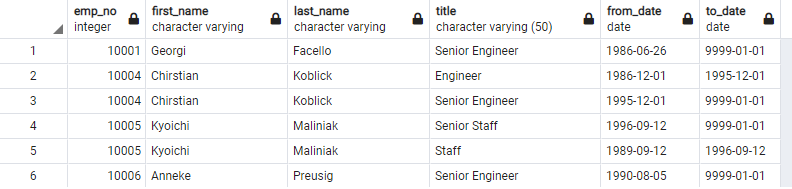

# Pewlett-Hackard-Analysis
## Overview of the analysis: 
The purpose of this analysis is to help the company Pewlett-Hackard determine their soon to retire employees, since most employees have been working there for a long time, we can see a "Silver Tsunami" coming. In other words, the company needs to identify older employees, hire new and younger folk working and get have soon-retiring employees as mentors of the new generations of employees.
## Results: 
During the process of this challenge four different tables were generated:
### Retirement Titles:
This table contained the employee number, first name and last name from the employees table and the title, hiring date and last date of employment from the titles table. The employees were filtered by they birth date, between the years 1952 and 1955. We can see that we have a number of 133,776 employees in this table, however, as shown in the table below, there are some employees that are repeated due to change in departments.

### Unique Titles
In order to solve the problem from the first table
## Summary:
Provide high-level responses to the following questions, then provide two additional queries or tables that may provide more insight into the upcoming "silver tsunami."
How many roles will need to be filled as the "silver tsunami" begins to make an impact?
Are there enough qualified, retirement-ready employees in the departments to mentor the next generation of Pewlett Hackard employees?
